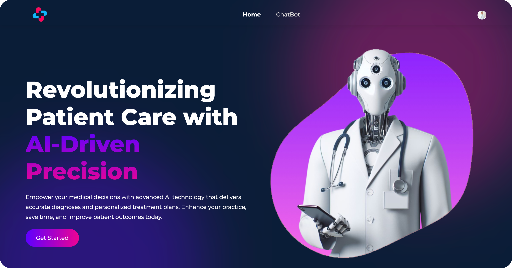
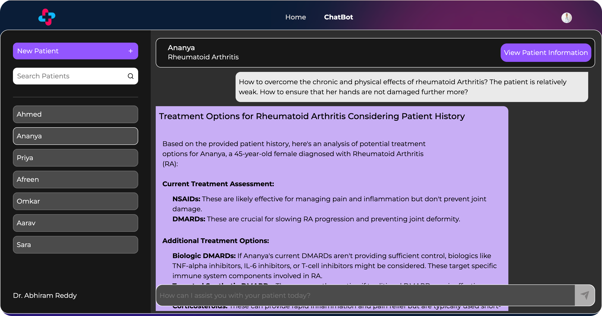
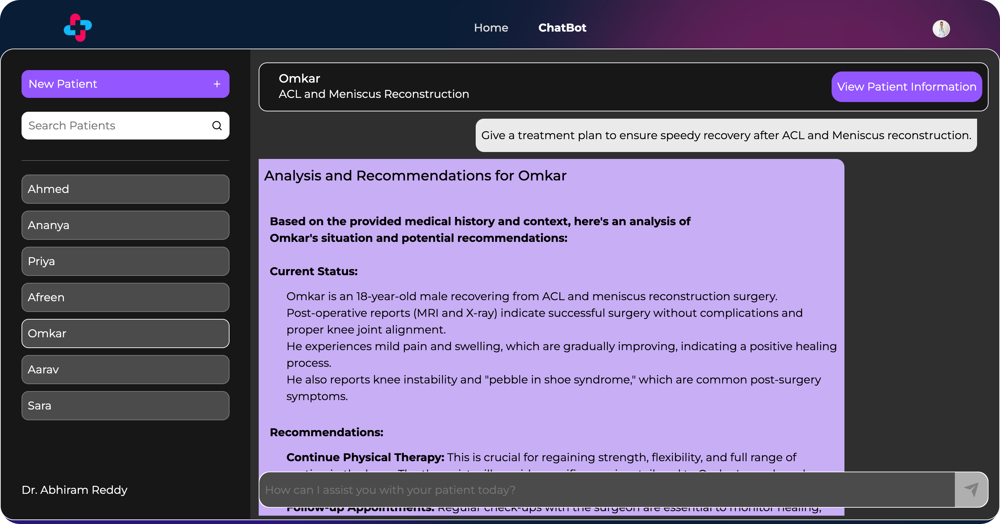

MedRaga - AI Enhanced Diagnostic & Treatment Planning System
===================================================

### Overview

This project utilizes Retrieval-Augmented Generation (RAG) to enhance the quality and relevance of medical information provided to doctors. It combines retrieval-based and generation-based models to offer personalized diagnoses and treatment plans based on the doctor's query and the patient's medical history.



### Features

1.  **RAG Pipeline**: Combines retrieval and generation models to provide comprehensive medical information tailored to each patient's needs.

2.  **Latest Medical Information**: Utilizes APIs and web scraping to gather the newest medical research from trusted sources, ensuring accuracy and relevance.

3.  **Personalization**: Takes into account the unique medical history of each patient to offer personalized diagnoses and treatment plans.

4.  **Trusted Information Sources**: Collects data only from reputable medical journals and websites, ensuring the reliability of the recommendations.
  


### Abstract

The project obtains the latest medical research from trusted sources using APIs and web scraping. PDF files and articles are downloaded, indexed, and converted to text embeddings using Cohere. These embeddings are stored as vectors in a vector database (Qdrant).

When a doctor queries the prototype, it retrieves the most relevant information and adds it to the context window of the Language Model (LLM). The LLM then takes the new context window, the original prompt, and the summarized patient history to generate the output.




### Set up project  
  
1. Clone the repository or download as zip and extract it.  
  
```  
git clone https://github.com/Abhiram-29/MedRaga-API  
```  
  
2. Create a virtual environment  
  
```  
python -m venv .venv  
```  
  
3. Activate .venv  
  
```  
.venv\Scripts\activate  
```  
  
4. Install required libraries and install playwright.  
  
```python  
pip install -r requirements.txt
playwright install
```

5. Download and run Qdrant  
   For Windows, run these commands from WSL.  
First, download the latest Qdrant image from Dockerhub:   
```
docker pull qdrant/qdrant
``` 
Then, run the service:
```
docker run -p 6333:6333 -p 6334:6334 \
    -v $(pwd)/qdrant_storage:/qdrant/storage:z \
    qdrant/qdrant
```
Qdrant is now accessible at `localhost:6333`  

6. Add API Keys to `.env`

7. Check path locations.

For Windows - paths are defined by `\\`  
For Mac OS - paths are defined by `/`  

8. Start API  
  
```python  
uvicorn app:app 
```
Do not use `--reload` tag, since the API contains `async` functions. API will break.
  
### Project Details  
  
**Language Used** - Python 3.9.13  
**API Framework** - FastAPI    
  
### API Endpoints  
  
##### /create/req=<json>  
  
**\<json\>** - Enter patient json here  
**Functionality** - Creating a new patient bucket  
  
##### /query/req=<json>
  
**\<json\>** - JSON must contain `id` and `prompt`  
**Functionality** - Queries the RAG pipeline   

##### /status
  
**Functionality** - Returns 200 OK if API is up  
  
  

  
    
